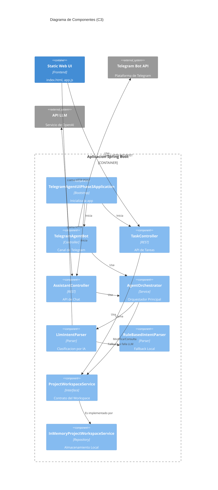

# 03. Component View

## Componentes internos principales

La fase 3 agrega capa web al backend agentico ya existente.

### `TelegramAgentUiPhase3Application`
- Rol: bootstrap.
- Responsabilidad: iniciar Spring Boot y registrar `BotProps` y `AiProps`.

### `TelegramAgentBot`
- Rol: canal Telegram.
- Responsabilidad: recibir updates y delegar el texto al `AgentOrchestrator`.

### `TaskController`
- Rol: API REST de tareas.
- Responsabilidad: listar tareas, crear tareas desde el formulario web.

### `AssistantController`
- Rol: API REST del asistente.
- Responsabilidad: recibir `ChatRequest`, invocar `AgentOrchestrator`, devolver `ChatResponse`.

### `AgentOrchestrator`
- Rol: cerebro compartido del asistente.
- Responsabilidad: interpretar mensajes, pedir aclaraciones, ejecutar consultas y acciones del dominio, devolver respuesta textual.

### `LlmIntentParser`
- Rol: parser AI.
- Responsabilidad: invocar un endpoint tipo OpenAI y convertir la salida a `ParsedIntent`.

### `RuleBasedIntentParser`
- Rol: fallback local.
- Responsabilidad: heuristicas y regex para intenciones comunes.

### `ProjectWorkspaceService`
- Rol: puerto del dominio.
- Responsabilidad: listar, filtrar y crear tareas, consultar sprint y carga.

### `InMemoryProjectWorkspaceService`
- Rol: store compartido del sistema.
- Responsabilidad: mantener el estado comun para Telegram, REST y web.

### Frontend estatico

#### `index.html`
- define layout de tareas y chat

#### `app.js`
- invoca `/api/tasks` y `/api/assistant/chat`
- renderiza tarjetas de tareas
- refresca lista tras crear tareas o conversar

#### `styles.css`
- aplica layout responsive de dos paneles

## Diagrama C3 (Component)

## Flujo interno por canal

### Telegram
1. `TelegramAgentBot` recibe mensaje.
2. `AgentOrchestrator` interpreta y responde.
3. El bot envia el texto a Telegram.

### Web chat
1. `app.js` hace `POST /api/assistant/chat`.
2. `AssistantController` delega al `AgentOrchestrator`.
3. La respuesta vuelve como JSON y se pinta en el chat.

### Web tareas
1. `app.js` hace `GET /api/tasks`.
2. `TaskController` devuelve la lista del workspace.
3. El formulario hace `POST /api/tasks`.
4. La UI refresca la lista despues de crear o consultar.

## Observaciones de diseño
- `AgentOrchestrator` es el punto de reutilizacion mas importante de toda la fase 3.
- La API REST no duplica logica de negocio: enruta hacia el mismo servicio o el mismo orquestador.
- El frontend no usa framework; eso reduce complejidad y deja visible el contrato HTTP.
